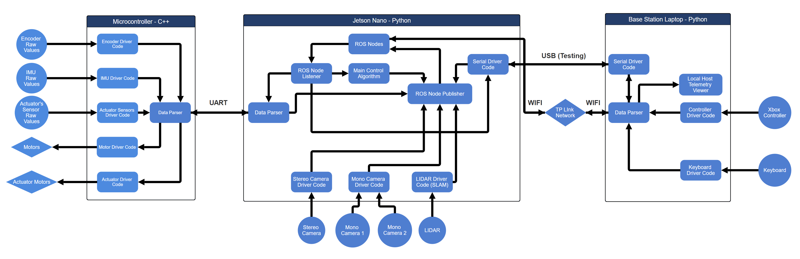

# Autonomous Robotics Platform – Software Architecture

This repository contains the software stack for an autonomous robotics platform built around:

- A **Microcontroller (C++)** for low-level hardware control  
- A **Jetson Nano (Python + ROS)** for high-level autonomy and perception  
- A **Base Station Laptop (Python)** for telemetry, visualisation, and manual control

The diagram below (stored in `Media/initial_software_system_diagram.png`) shows the overall data and control flow:

---

## 1. High-Level Overview

The system is organised into three main blocks:

1. **Microcontroller – C++**
   - Talks directly to encoders, IMU, and actuator sensors
   - Drives motors and actuators
   - Sends/receives data over **UART** to the Jetson Nano

2. **Jetson Nano – Python / ROS**
   - Runs ROS nodes for sensing, state estimation, and control
   - Hosts the **main control algorithm**
   - Interfaces with cameras and LiDAR (including SLAM)
   - Bridges between microcontroller and base station (UART + Wi-Fi)

3. **Base Station Laptop – Python**
   - Provides telemetry viewer and logging
   - Handles input from **Xbox controller** and **keyboard**
   - Communicates with Jetson over **Wi-Fi**, with optional **USB** serial link for testing

---

## 2. Microcontroller (C++)

The microcontroller is responsible for all low-level, time-critical I/O.

### 2.1 Inputs

- **Encoder Raw Values**  
  Read by the **Encoder Driver Code** to measure wheel/shaft position and velocity.

- **IMU Raw Values**  
  Read by the **IMU Driver Code** to obtain orientation and acceleration data.

- **Actuator’s Sensor Raw Values**  
  Read by the **Actuator Sensors Driver Code** to monitor actuator positions, limits, or feedback sensors.

### 2.2 Processing

- **Data Parser**  
  Collects and formats data from all sensor drivers.  
  Prepares packets for transmission to the Jetson Nano over UART and decodes incoming commands.

### 2.3 Outputs

- **Motor Driver Code → Motors**  
  Receives control commands (e.g. velocity, torque) and converts them into low-level motor signals (PWM, direction, etc.).

- **Actuator Driver Code → Actuator Motors**  
  Drives additional actuators (e.g. steering, arm mechanisms, grippers) based on commands from the Jetson.

### 2.4 Communication

- **UART Link to Jetson Nano**  
  All sensor data and actuator/motor commands are exchanged via a serial protocol over UART.

---

## 3. Jetson Nano (Python + ROS)

The Jetson is the “brain” of the system, running ROS and the main control logic.

### 3.1 Core ROS Components

- **ROS Nodes**  
  The individual ROS processes used for perception, control, and communication.

- **ROS Node Listener**  
  Subscribes to topics populated from the **Data Parser** (incoming UART data) and other sensors.

- **Main Control Algorithm**  
  Implements the high-level behaviour:
  - state estimation and fusion
  - path following / navigation
  - generation of motor and actuator commands

- **ROS Node Publisher**  
  Publishes control commands that are fed back into the **Serial Driver Code** for transmission to the microcontroller.

### 3.2 Sensor Drivers

- **Stereo Camera Driver Code → Stereo Camera**  
  Provides stereo images and depth information into ROS topics.

- **Mono Camera Driver Code → Mono Camera 1 / Mono Camera 2**  
  Provides additional monocular vision streams for tasks such as object detection or tracking.

- **LIDAR Driver Code (SLAM) → LIDAR**  
  Handles LiDAR data acquisition and feeds SLAM modules for mapping and localisation.

### 3.3 Serial & Networking

- **Data Parser**  
  Converts raw UART packets from the microcontroller into ROS-friendly messages (and vice versa).

- **Serial Driver Code**  
  Manages the UART link to the microcontroller.

- **Wi-Fi (TP-Link Network)**  
  Connects the Jetson to the base station laptop for telemetry and remote control.

- **USB (Testing)**  
  Optional direct serial link to the base station for development and debugging.

---

## 4. Base Station Laptop (Python)

The base station is used for operator interaction, monitoring, and debugging.

### 4.1 Communication & Parsing

- **Serial Driver Code**  
  Handles USB serial communication during testing/development.

- **Data Parser**  
  Decodes data streams from the Jetson (via Wi-Fi or USB) into usable telemetry and status information.

### 4.2 Operator Interfaces

- **Local Host Telemetry Viewer**  
  A local GUI or web-based dashboard that shows:
  - live sensor data  
  - system status and alerts  
  - control outputs  
  - possibly SLAM maps and camera feeds (depending on implementation)

- **Controller Driver Code → Xbox Controller**  
  Reads input from an Xbox controller and converts it into command messages (e.g. velocity, steering, mode switching).

- **Keyboard Driver Code → Keyboard**  
  Allows manual control and shortcuts directly from the keyboard (e.g. arming, stopping, or sending test commands).

---

## 5. Communication Summary

| Link                     | Direction                  | Purpose                                    |
|--------------------------|---------------------------|--------------------------------------------|
| **UART**                 | Microcontroller ↔ Jetson  | Sensor data and motor/actuator commands    |
| **Wi-Fi (TP-Link)**      | Jetson ↔ Base Station     | Telemetry, remote control, monitoring      |
| **USB (Testing)**        | Jetson ↔ Base Station     | Debugging, development serial connection   |
| **Gamepad / Keyboard**   | Base Station → Jetson     | Manual control commands                    |

---
