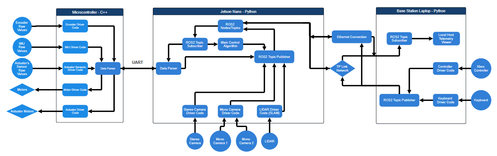

# Autonomous Robotics Platform – Software Architecture

This repository contains the software stack for the **QPL autonomous robotics platform**, designed around a clear separation of low-level control, high-level autonomy, and operator interaction.

The system is built on three main compute layers:

- **Microcontroller (C++)** – real-time, low-level hardware control  
- **Jetson Nano (Python + ROS2)** – perception, autonomy, and control  
- **Base Station Laptop (Python)** – telemetry, visualisation, and manual control  

The diagram below (stored in `Media/software_system_diagram_revB.png`) illustrates the complete data and control flow across the system:

---

## 1. System Overview

The architecture follows a **hierarchical robotics design**:

1. **Microcontroller layer** handles time-critical I/O and actuator control.  
2. **Jetson Nano layer** performs sensor fusion, autonomy, and ROS2-based coordination.  
3. **Base Station layer** provides monitoring, logging, and human-in-the-loop control.

Each layer communicates using clearly defined interfaces (UART, ROS2 topics, and network links), allowing components to be developed and tested independently.

---

## 2. Microcontroller (C++)

The microcontroller is responsible for all **hard real-time tasks** and direct hardware interaction.

### 2.1 Sensor Inputs

- **Encoders**  
  Raw encoder signals are read by the *Encoder Driver Code* to compute wheel/shaft position and velocity.

- **IMU**  
  The *IMU Driver Code* acquires inertial data such as orientation, angular velocity, and acceleration.

- **Actuator Sensors**  
  The *Actuator Sensors Driver Code* monitors feedback from actuators (position, limits, or load feedback).

### 2.2 Internal Processing

- **Data Parser**  
  Aggregates all sensor data into structured packets.  
  Handles encoding and decoding of commands and telemetry exchanged with the Jetson Nano.

### 2.3 Actuation Outputs

- **Motor Driver Code → Motors**  
  Converts high-level commands into low-level motor signals (PWM, direction, enable, etc.).

- **Actuator Driver Code → Actuator Motors**  
  Controls additional actuators such as steering, mechanisms, or end-effectors.

### 2.4 Communication

- **UART ↔ Jetson Nano**  
  A bidirectional serial link used to:
  - transmit sensor data upstream  
  - receive motor and actuator commands downstream  

---

## 3. Jetson Nano (Python + ROS2)

The Jetson Nano acts as the **central compute node** and runs the ROS2 ecosystem.

### 3.1 Core ROS2 Architecture

- **ROS2 Nodes & Topics**  
  Modular ROS2 nodes encapsulate sensing, control, and communication functionality.

- **ROS2 Topic Subscribers**  
  Consume:
  - parsed UART data from the microcontroller  
  - sensor data from cameras and LiDAR  

- **Main Control Algorithm**  
  Implements the robot’s high-level behaviour, including:
  - state estimation and sensor fusion  
  - navigation and path following  
  - generation of motor and actuator setpoints  

- **ROS2 Topic Publishers**  
  Publish control commands that are forwarded to the microcontroller via the serial interface.

### 3.2 Perception & Sensors

- **Stereo Camera Driver**  
  Produces stereo image streams and depth information for perception tasks.

- **Mono Camera Drivers (Camera 1 & 2)**  
  Provide additional vision inputs for object detection, tracking, or redundancy.

- **LiDAR Driver (SLAM)**  
  Acquires LiDAR scans and feeds SLAM modules for mapping and localisation.

### 3.3 Serial & Networking

- **Serial Driver + Data Parser**  
  Translates between UART packets and ROS2 messages.

- **Wi-Fi (TP-Link Network)**  
  Primary communication channel between the Jetson and the base station for telemetry and control.

- **Ethernet (Development / Testing)**  
  Optional wired link used for debugging, testing, and high-bandwidth development tasks.

---

## 4. Base Station Laptop (Python)

The base station provides **human-in-the-loop interaction** and system visibility.

### 4.1 Telemetry & Communication

- **ROS2 Topic Subscriber**  
  Receives telemetry streams from the Jetson Nano.

- **Local Host Telemetry Viewer**  
  Displays:
  - live sensor values  
  - robot state and diagnostics  
  - control outputs  
  - (optionally) SLAM maps and camera feeds  

### 4.2 Operator Input

- **Controller Driver Code → Xbox Controller**  
  Converts gamepad inputs into command messages (velocity, steering, mode selection).

- **Keyboard Driver Code → Keyboard**  
  Enables manual overrides, shortcuts, and emergency commands.

- **ROS2 Topic Publisher**  
  Publishes operator commands to the Jetson over the network.

---

## 5. Communication Summary

| Link | Direction | Purpose |
|-----|----------|---------|
| **UART** | Microcontroller ↔ Jetson | Sensor data and actuator commands |
| **Wi-Fi (TP-Link)** | Jetson ↔ Base Station | Telemetry, control, monitoring |
| **Ethernet** | Jetson ↔ Base Station | Development and debugging |
| **Gamepad / Keyboard** | Base Station → Jetson | Manual operator commands |

---

## 6. Design Philosophy

- **Layered architecture** separates real-time control from high-level autonomy  
- **ROS2 modularity** enables scalable development and testing  
- **Clear interfaces** (UART, topics, network links) reduce coupling  
- **Human-in-the-loop support** ensures safe testing and operation  

This structure allows the platform to scale from manual tele-operation to fully autonomous operation with minimal architectural changes.
