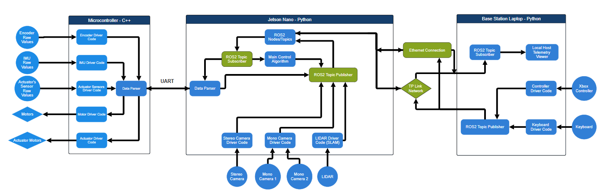

## 🚧 Current Implementation Status (Progress Branch)

This branch represents the **current development state** of the autonomous robotics software stack.

The diagram below highlights which components have been **implemented and verified so far**.  
**Green blocks indicate functionality that is already built and operational**, while blue blocks represent planned or in-progress components.

### Implemented Components

At this stage of development, the following core elements are in place:

- **ROS2 Topic Subscriber (Jetson Nano)**  
  - Successfully receiving and handling incoming ROS2 messages
  - Forms the basis for sensor ingestion and inter-node communication

- **ROS2 Topic Publisher (Jetson Nano)**  
  - Publishing structured control and status messages
  - Enables downstream integration with control logic and external nodes

- **Ethernet Communication Link**  
  - Stable wired connection between Jetson Nano and Base Station
  - Used for testing, debugging, and high-reliability data transfer

- **TP-Link Network (Wi-Fi Infrastructure)**  
  - Network layer established for wireless ROS2 communication
  - Foundation for remote telemetry and operator control

### Purpose of This Stage

This milestone focuses on validating:
- ROS2 node structure and message flow
- Network communication between compute layers
- End-to-end data paths before integrating hardware drivers and control algorithms

Future work will progressively enable the remaining subsystems (highlighted in blue), including low-level microcontroller integration, perception pipelines, and the main control algorithm.
