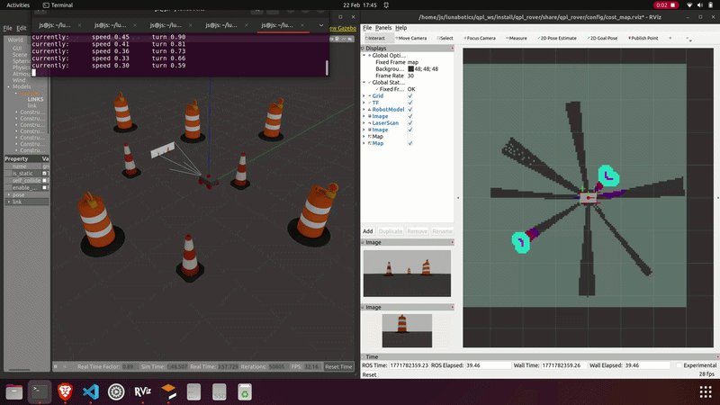
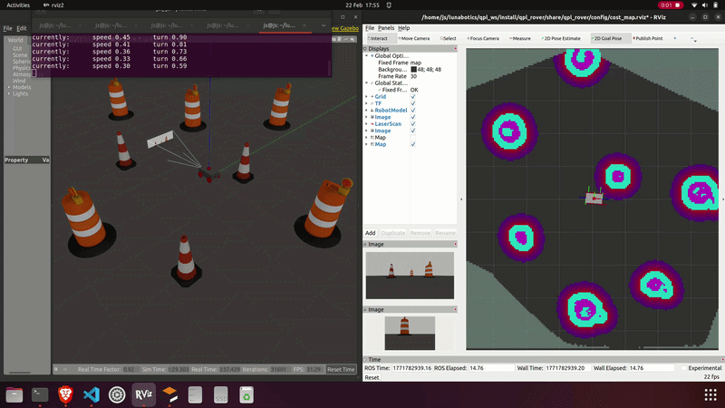

# 🛰️ Lunabotics ROS 2 & RViz – Project Structure and Usage Guide

This README explains **how the ROS 2 workspace in this repo is organised**, **where to run commands from**, and **how to build, run, visualise, and drive the robot in RViz**.

It is written to be **step-by-step and foolproof**.  
If you follow this exactly, it will work.

---

## 1. Repository Structure (What Lives Where)

```
lunabotics/
├── qpl_ws/ ← ROS 2 WORKSPACE ROOT (IMPORTANT)
│   └── src/ ← ALL ROS PACKAGES LIVE HERE
│       └── qpl_rover/ ← Package Name 
|           ├── config ← config/parameter files 
|           ├── description ← Rover description, includes rover appearance, rover sensors, sensor pipeline (ros2_control)
|           ├── launch ← Launch files for the rover
|           ├── maps ← Slam maps 
|           └── worlds ← Gazebo worlds  
│
├── Media/
└── README.md              
```

- **All ROS packages must live inside `qpl_ws/src/`**
- Never edit `build/`, `install/`, or `log/`

---

## 2. Setup
Ensure your ~/.bashrc file contains the following, replacing the value of `QPL_PROJECT`
with the path to your local copy of the repo:
```bash
# ---------- Lunabotics ----------
export QPL_PROJECT="$HOME/lunabotics"
source "$QPL_PROJECT"/process/startup.sh
# --------------------------------
```

### Verify setup
If you've built before:
```bash
ros2 run basestation nav_pub
```
- This should run a simple publisher; you should see some logs indicating that it's publishing messages. 
Ctrl+C to stop it. This means 1) ROS is sourced and 2) the workspace is sourced.

If you haven't built before, run ```qpl_build```.

You'll now able to use a number of commands to build and run parts of the project, such as:
```bash
qpl_packages # Run to ensure all packages are installed
qpl_build # Build the ROS workspace
qpl_sim # This runs Gazebo (simulation) with GUI and processes using GPU
qpl_headless # This runs Gazebo (simulation) with no GUI and processes using CPU
qpl_rviz # This runs RViz with preset settings
luna_kb # See next section
```
>**Important!**
>- After any code changes in ROS packages, run ```qpl_build```.
>- If you rely on any new package, add it to the **process/install_packages.sh**

## 3. Driving the rover via luna_kb
```qpl_kb``` runs a keyboard teleoperation node; this was not made by us and is for testing only.
A more user-friendly node will be accessible soon.

**Default controls**
- `i` → forward
- `k` → stop
- `j` / `l` → rotate left / right
- `,` → reverse
- `q` / `z` → increase / decrease speed

📌 **Important**
- Click inside the terminal before pressing keys
- Keep this terminal open while driving

---

## 4. Working with SLAM
## Launch SLAM (Mapping)
```bash
qpl_slam
```
This node starts the SLAM system (*Simulateous Localisation and Mapping*).
The rover uses 2D LiDAR data to build a 2D map of the environment while estimating its own position inside that map.
### SLAM Visualisation
<p align="left">
  
</p>

---


## Launch Navigation (Nav2)
```bash 
nav2
```
This node starts ROS2 Navigation Stack (Nav2).
The rover uses the previously built map to plan paths and autonomously drive to goal positions that you click in RViz.
## Nav2 Visualisation
<p align="left">
  
</p>

## 5. Helpful ROS commands

List all available topics,
```bash
ros2 topic list
```
Listen to a specific topic,
```bash
ros2 topic echo /topic_name
```

Test node communication (if you're having trouble with node communication)
```bash
# On some terminal, set up for receiving
ros2 multicast receive
# On another terminal, send multicast message
ros2 multicast send
```


## 6. How to Run Python Files

- If you use relative imports (from . / from ..) you must run with -m.
- Don't mix "run as a file path" with relative imports.

From your home directory,
```bash
cd $LUNA_PROJECT/../
python3 -m lunabotics
```

## 7. Remote simulation
Jamie has a server running the simulation. This has two advantages: it reduces the load on our
local machines, and is slightly more accurate to the real rover in terms of communication structure.
1. Install Tailscale from https://tailscale.com/download; this is a VPN so that you can treat the server as a local device.
2. Ask Jamie for access to his Tailscale network and the username and password; once connected, you will be able to SSH in.
3. On Windows, you can view Tailscale in the system tray; click Network devices > Jamie Smith > server to copy the server IP.
